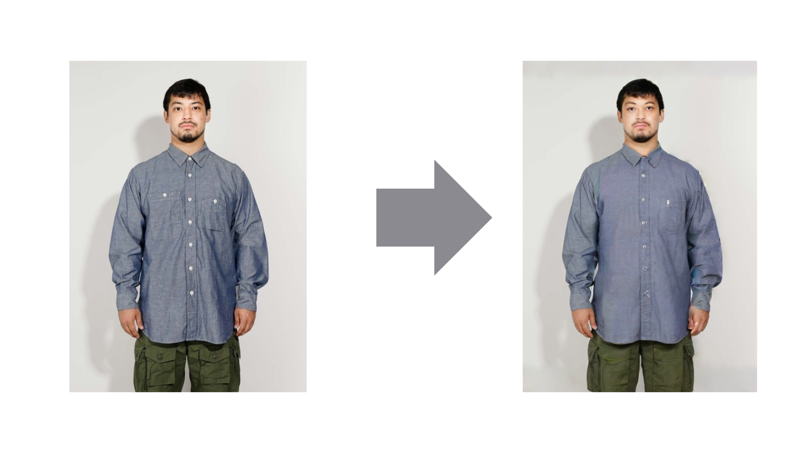

# Project Iron The Dress

This is the read me of project Iron the dress

Iron the dress is a project where we used AI to remove the wrinkles from the dress.

## Output

    

**Features:**

- Model we use was **SDXL-Turbo from StableDiffusion**
- Model we trained on lora using [Notebook](https://colab.research.google.com/drive/1ocj7isaZTwsd2j43Fy5RvNDl1F03RLw8?usp=sharing)
- It was trained on 40 images with classification method like wrinkled and unwrinkled
- If you want to use [lora-weights](https://drive.google.com/file/d/1TTaR_EmAmgPYIfjXoUIrbMJMA26V1eZ8/view?usp=sharing) here is the link 
- [Report Papers](https://drive.google.com/file/d/16sNnr_CUgQh95DG_SXpmSkv22pPmZ5lV/view?usp=drive_link)
  
If you want to use this repo clone it then use `npm install` to install all required packages
then follow below steps

## Getting Started

First, run the development server:

```bash
npm run dev
# or
yarn dev
# or
pnpm dev
# or
bun dev
```

Open [http://localhost:3000](http://localhost:3000) with your browser to see the result.

You can start editing the page by modifying `app/page.tsx`. The page auto-updates as you edit the file.

This project uses [`next/font`](https://nextjs.org/docs/basic-features/font-optimization) to automatically optimize and load Inter, a custom Google Font.

## Learn More

To learn more about Next.js, take a look at the following resources:

- [Next.js Documentation](https://nextjs.org/docs) - learn about Next.js features and API.
- [Learn Next.js](https://nextjs.org/learn) - an interactive Next.js tutorial.

You can check out [the Next.js GitHub repository](https://github.com/vercel/next.js/) - your feedback and contributions are welcome!

## Deploy on Vercel

The easiest way to deploy your Next.js app is to use the [Vercel Platform](https://vercel.com/new?utm_medium=default-template&filter=next.js&utm_source=create-next-app&utm_campaign=create-next-app-readme) from the creators of Next.js.

Check out our [Next.js deployment documentation](https://nextjs.org/docs/deployment) for more details.

## Developer

Develope by [@Abdullah Zulfiqar and @Shivansh Yadav](https://github.com/AbdullahZulfikar).
